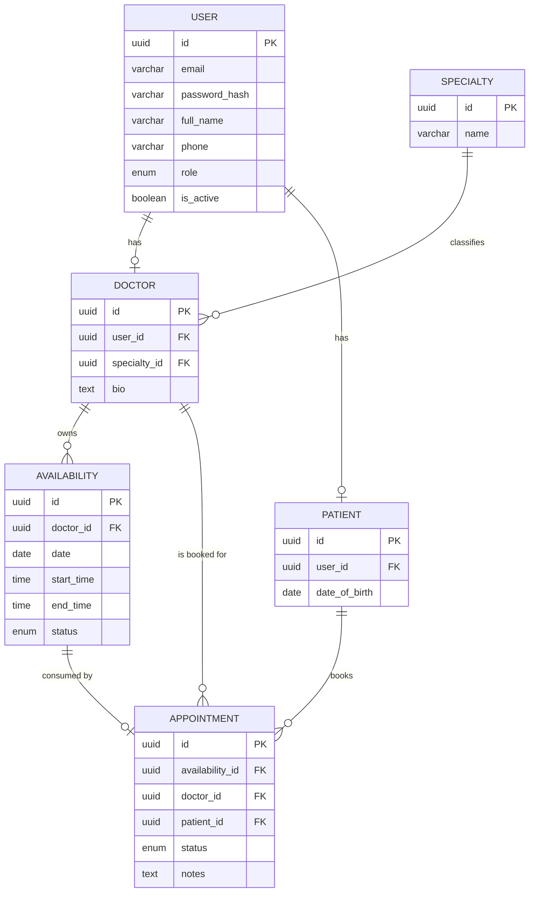

# Clinic Booking API — Database Design

## Database Overview

The schema is a normalized relational model with six tables. `users` holds shared account data (email, password hash, role) for patients, doctors, and admins alike. `doctors` and `patients` extend `users` with role-specific profile fields through a one-to-one relationship. `specialties` is a small, admin-managed lookup table. `availabilities` represents individual bookable time slots owned by a doctor, and `appointments` links a patient to exactly one availability slot.

The relationship between `availabilities` and `appointments` is the core of the design: an appointment cannot exist without consuming a specific slot, and a slot can back at most one active appointment. That relationship is what prevents double booking at the schema level, rather than relying purely on application logic.

## Tables

### users

| Column | Type | Nullable | Default | PK | FK | Unique | Description |
|---|---|---|---|---|---|---|---|
| id | UUID | No | gen_random_uuid() | Yes | — | — | Primary key |
| email | VARCHAR(255) | No | — | No | — | Yes | Login email |
| password_hash | VARCHAR(255) | No | — | No | — | — | Bcrypt password hash |
| full_name | VARCHAR(150) | No | — | No | — | — | Display name |
| phone | VARCHAR(30) | Yes | NULL | No | — | — | Contact phone |
| role | user_role (enum) | No | — | No | — | — | PATIENT / DOCTOR / ADMIN |
| is_active | BOOLEAN | No | true | No | — | — | Soft deactivation flag |
| created_at | TIMESTAMPTZ | No | now() | No | — | — | Record creation time |
| updated_at | TIMESTAMPTZ | No | now() | No | — | — | Record update time |

### specialties

| Column | Type | Nullable | Default | PK | FK | Unique | Description |
|---|---|---|---|---|---|---|---|
| id | UUID | No | gen_random_uuid() | Yes | — | — | Primary key |
| name | VARCHAR(100) | No | — | No | — | Yes | Specialty name (e.g. "Cardiology") |
| created_at | TIMESTAMPTZ | No | now() | No | — | — | Record creation time |

### doctors

| Column | Type | Nullable | Default | PK | FK | Unique | Description |
|---|---|---|---|---|---|---|---|
| id | UUID | No | gen_random_uuid() | Yes | — | — | Primary key |
| user_id | UUID | No | — | No | users.id | Yes | One-to-one link to the account |
| specialty_id | UUID | No | — | No | specialties.id | — | Doctor's specialty |
| bio | TEXT | Yes | NULL | No | — | — | Short professional bio |
| created_at | TIMESTAMPTZ | No | now() | No | — | — | Record creation time |
| updated_at | TIMESTAMPTZ | No | now() | No | — | — | Record update time |

### patients

| Column | Type | Nullable | Default | PK | FK | Unique | Description |
|---|---|---|---|---|---|---|---|
| id | UUID | No | gen_random_uuid() | Yes | — | — | Primary key |
| user_id | UUID | No | — | No | users.id | Yes | One-to-one link to the account |
| date_of_birth | DATE | Yes | NULL | No | — | — | Patient date of birth |
| created_at | TIMESTAMPTZ | No | now() | No | — | — | Record creation time |
| updated_at | TIMESTAMPTZ | No | now() | No | — | — | Record update time |

### availabilities

| Column | Type | Nullable | Default | PK | FK | Unique | Description |
|---|---|---|---|---|---|---|---|
| id | UUID | No | gen_random_uuid() | Yes | — | — | Primary key |
| doctor_id | UUID | No | — | No | doctors.id | — | Owning doctor |
| date | DATE | No | — | No | — | — | Date of the slot |
| start_time | TIME | No | — | No | — | — | Slot start time |
| end_time | TIME | No | — | No | — | — | Slot end time |
| status | availability_status (enum) | No | 'AVAILABLE' | No | — | — | AVAILABLE / BOOKED |
| created_at | TIMESTAMPTZ | No | now() | No | — | — | Record creation time |
| updated_at | TIMESTAMPTZ | No | now() | No | — | — | Record update time |

### appointments

| Column | Type | Nullable | Default | PK | FK | Unique | Description |
|---|---|---|---|---|---|---|---|
| id | UUID | No | gen_random_uuid() | Yes | — | — | Primary key |
| availability_id | UUID | No | — | No | availabilities.id | Yes | The slot this appointment consumes |
| doctor_id | UUID | No | — | No | doctors.id | — | Denormalized for simpler querying |
| patient_id | UUID | No | — | No | patients.id | — | Booking patient |
| status | appointment_status (enum) | No | 'PENDING' | No | — | — | Appointment lifecycle status |
| notes | TEXT | Yes | NULL | No | — | — | Optional patient-provided note |
| created_at | TIMESTAMPTZ | No | now() | No | — | — | Record creation time |
| updated_at | TIMESTAMPTZ | No | now() | No | — | — | Record update time |

## Relationships

```text
User (1) → (0..1) Doctor
User (1) → (0..1) Patient
Specialty (1) → (many) Doctor
Doctor (1) → (many) Availability
Doctor (1) → (many) Appointment      [denormalized reference]
Patient (1) → (many) Appointment
Availability (1) → (0..1) Appointment
```

- A `User` has at most one `Doctor` profile and at most one `Patient` profile — in practice exactly one of the two, except admins, who have neither.
- A `Doctor` belongs to exactly one `Specialty`.
- A `Doctor` owns many `Availability` slots and, through those, many `Appointment` records.
- A `Patient` can hold many `Appointment` records.
- Each `Availability` slot backs at most one `Appointment`.

## Constraints

- `users.email` — UNIQUE, NOT NULL
- `doctors.user_id` — UNIQUE, NOT NULL, FK → `users.id`
- `patients.user_id` — UNIQUE, NOT NULL, FK → `users.id`
- `doctors.specialty_id` — NOT NULL, FK → `specialties.id`
- `specialties.name` — UNIQUE, NOT NULL
- `availabilities.doctor_id` — NOT NULL, FK → `doctors.id`
- CHECK on `availabilities`: `end_time > start_time`
- `appointments.availability_id` — UNIQUE, NOT NULL, FK → `availabilities.id` — this uniqueness constraint is the actual double-booking safeguard
- `appointments.doctor_id` — NOT NULL, FK → `doctors.id`
- `appointments.patient_id` — NOT NULL, FK → `patients.id`

## Indexes

- `users(email)` — backs login lookups (also enforced by the UNIQUE constraint).
- `availabilities(doctor_id, date)` — supports the frequent "get a doctor's slots for a date range" query.
- `appointments(patient_id)` — supports "get my appointments" for patients.
- `appointments(doctor_id)` — supports "get my appointments" for doctors.

No further indexes are added; these directly match the query patterns the API actually needs.

## Enums

- `user_role`: `PATIENT`, `DOCTOR`, `ADMIN`
- `availability_status`: `AVAILABLE`, `BOOKED`
- `appointment_status`: `PENDING`, `CONFIRMED`, `CANCELLED`, `COMPLETED`

No other enums are introduced — these are the only fields with a fixed, closed set of values.

## ERD



## Prisma Considerations

Each table above maps directly to a Prisma model, with the enums defined as Prisma `enum` blocks (`Role`, `AvailabilityStatus`, `AppointmentStatus`). `doctors.user_id` and `patients.user_id` become `@unique` foreign keys with a `@relation` back to `User`, giving the one-to-one relationship. `appointments.availability_id` is `@unique`, which is what makes Prisma (and Postgres) reject a second appointment against the same slot.

The booking operation — checking a slot is `AVAILABLE`, creating the appointment, and flipping the slot to `BOOKED` — is the one place a Prisma `$transaction` is actually needed, since it touches two tables and must be atomic. Cancellation (updating appointment status and releasing the slot) uses the same pattern. Everything else in the API is simple enough not to need explicit transactions.

A full `schema.prisma` is not included here since it would just restate the tables above in Prisma's syntax; it will be written directly during implementation from this document.

## Important Database Decisions

- **User/Doctor/Patient modeling:** A single `users` table carries shared auth/account fields for every role, with `doctors` and `patients` as thin one-to-one extension tables. This avoids duplicating auth logic per role while keeping role-specific fields out of a bloated `users` table.
- **Appointment modeling:** An appointment always references a specific `availability` row rather than storing a free-form date/time. This turns "one slot, one appointment" into a database guarantee (the UNIQUE constraint on `availability_id`) instead of a rule the application has to re-check on every write.
- **Availability modeling:** Slots are created individually by the doctor (a specific date + start/end time) rather than generated from a recurring pattern. This keeps availability management simple and avoids building a recurrence engine, which is out of scope.
- **Appointment status:** A four-state enum (`PENDING → CONFIRMED → COMPLETED`, with `CANCELLED` reachable from the first two) is enough to demonstrate a real, controlled status lifecycle without inventing states the application has no use for.
- **Preventing double booking:** Enforced at two levels — the UNIQUE constraint on `appointments.availability_id` at the database layer, and the `AVAILABLE` → `BOOKED` status check performed inside the booking transaction before the insert.
- **Foreign key relationships:** All foreign keys use `ON DELETE RESTRICT` by default (no cascading deletes), since account or slot deletion should be a deliberate, explicit operation (e.g. deactivation) rather than something that silently removes historical appointment data.
