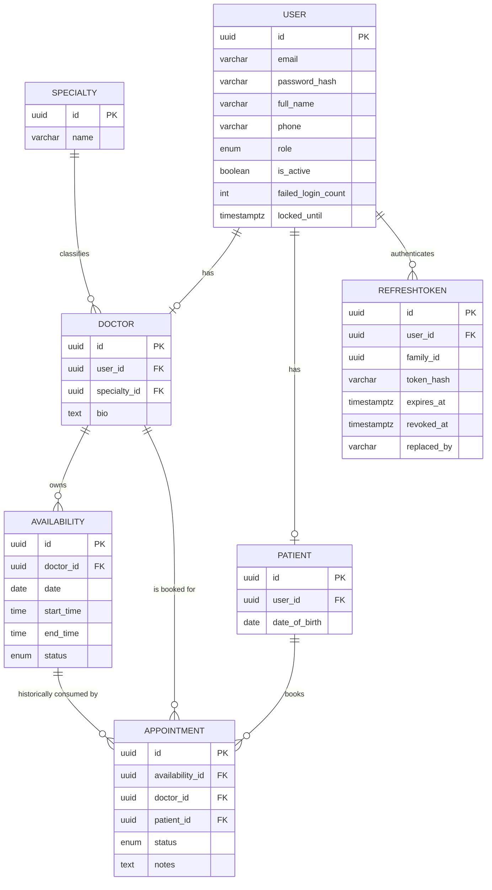

# Clinic Booking API — Database Design

## Database Overview

The schema is a normalized relational model with six PostgreSQL tables: `"User"`, `"Specialty"`, `"Doctor"`, `"Patient"`, `"Availability"`, and `"Appointment"`. Prisma's existing PascalCase model names map directly to these quoted table names; this convention is retained to avoid unnecessary migration work. `"User"` holds shared account data (email, password hash, role) for patients, doctors, and admins alike. `"Doctor"` and `"Patient"` extend `"User"` with role-specific profile fields through a one-to-one relationship. `"Specialty"` is a small, admin-managed lookup table. `"Availability"` represents individual bookable time slots owned by a doctor, and `"Appointment"` records a patient's use of a slot.

The relationship between `"Availability"` and `"Appointment"` is the core of the design. An appointment cannot exist without consuming a specific slot. A slot may have several historical appointments after cancellations, but PostgreSQL permits only one non-`CANCELLED` appointment for it at a time. That partial unique index is the database-level double-booking safeguard.

> Implementation status: the foundation migration currently has a simple unique constraint on `"Appointment"."availability_id"`. It will be replaced in the appointment milestone by the partial unique index described here, so cancellation can release a slot while appointment history remains intact. The availability `end_time > start_time` check has been added in the availability milestone (migration `20260824235847_add_availability_end_time_check`).

## Tables

### "User"

| Column | Type | Nullable | Default | PK | FK | Unique | Description |
|---|---|---|---|---|---|---|---|
| id | UUID | No | gen_random_uuid() | Yes | — | — | Primary key |
| email | VARCHAR(255) | No | — | No | — | Yes | Login email |
| password_hash | VARCHAR(255) | No | — | No | — | — | Bcrypt password hash |
| full_name | VARCHAR(150) | No | — | No | — | — | Display name |
| phone | VARCHAR(30) | Yes | NULL | No | — | — | Contact phone |
| role | user_role (enum) | No | — | No | — | — | PATIENT / DOCTOR / ADMIN |
| is_active | BOOLEAN | No | true | No | — | — | Soft deactivation flag |
| failed_login_count | INTEGER | No | 0 | No | — | — | Consecutive failed logins since last success/lock |
| locked_until | TIMESTAMPTZ | Yes | NULL | No | — | — | Login lockout expiry (null = not locked) |
| created_at | TIMESTAMPTZ | No | now() | No | — | — | Record creation time |
| updated_at | TIMESTAMPTZ | No | now() | No | — | — | Record update time |

The lockout columns support the login lockout policy (5 failed attempts → 15 minute lock). The lockout state lives on the `"User"` row because it is account-level authentication state: there is no need for a separate table while a small clinic can have one concurrent session policy for the whole account. `failed_login_count` resets to 0 on successful login and when a lock is applied; `locked_until` is cleared on successful login.

### "RefreshToken"

| Column | Type | Nullable | Default | PK | FK | Unique | Description |
|---|---|---|---|---|---|---|---|
| id | UUID | No | gen_random_uuid() | Yes | — | — | Primary key |
| user_id | UUID | No | — | No | users.id | — | Owning account |
| family_id | UUID | No | — | No | — | — | Rotation family; one login chain |
| token_hash | VARCHAR(64) | No | — | No | — | Yes | SHA-256 of the opaque refresh token |
| expires_at | TIMESTAMPTZ | No | — | No | — | — | Token expiry (30 days) |
| created_at | TIMESTAMPTZ | No | now() | No | — | — | Record creation time |
| revoked_at | TIMESTAMPTZ | Yes | NULL | No | — | — | Revocation time (null = active) |
| replaced_by | VARCHAR(64) | Yes | NULL | No | — | — | Hash of the token that rotated this one |

Refresh tokens are opaque random strings generated by the application; the database stores only their SHA-256 hash, so a database leak does not expose usable tokens. Rotation works by revoking the presented token (setting `revoked_at` and `replaced_by`) and inserting a new token with the same `family_id` — atomically, inside a transaction. Reuse of an already-revoked token revokes the whole family (the `family_id`), which is the token-theft response. Logout revokes the presented token's family. Expired or revoked rows are not garbage-collected; at this project's scale they are negligible in size and can be purged manually if ever needed.

### "Specialty"

| Column | Type | Nullable | Default | PK | FK | Unique | Description |
|---|---|---|---|---|---|---|---|
| id | UUID | No | gen_random_uuid() | Yes | — | — | Primary key |
| name | VARCHAR(100) | No | — | No | — | Yes | Specialty name (e.g. "Cardiology") |
| created_at | TIMESTAMPTZ | No | now() | No | — | — | Record creation time |

### "Doctor"

| Column | Type | Nullable | Default | PK | FK | Unique | Description |
|---|---|---|---|---|---|---|---|
| id | UUID | No | gen_random_uuid() | Yes | — | — | Primary key |
| user_id | UUID | No | — | No | users.id | Yes | One-to-one link to the account |
| specialty_id | UUID | No | — | No | specialties.id | — | Doctor's specialty |
| bio | TEXT | Yes | NULL | No | — | — | Short professional bio |
| created_at | TIMESTAMPTZ | No | now() | No | — | — | Record creation time |
| updated_at | TIMESTAMPTZ | No | now() | No | — | — | Record update time |

### "Patient"

| Column | Type | Nullable | Default | PK | FK | Unique | Description |
|---|---|---|---|---|---|---|---|
| id | UUID | No | gen_random_uuid() | Yes | — | — | Primary key |
| user_id | UUID | No | — | No | users.id | Yes | One-to-one link to the account |
| date_of_birth | DATE | Yes | NULL | No | — | — | Patient date of birth |
| created_at | TIMESTAMPTZ | No | now() | No | — | — | Record creation time |
| updated_at | TIMESTAMPTZ | No | now() | No | — | — | Record update time |

### "Availability"

| Column | Type | Nullable | Default | PK | FK | Unique | Description |
|---|---|---|---|---|---|---|---|
| id | UUID | No | gen_random_uuid() | Yes | — | — | Primary key |
| doctor_id | UUID | No | — | No | doctors.id | — | Owning doctor |
| date | DATE | No | — | No | — | — | Date of the slot |
| start_time | TIME | No | — | No | — | — | Slot start time |
| end_time | TIME | No | — | No | — | — | Slot end time |
| status | availability_status (enum) | No | 'AVAILABLE' | No | — | — | AVAILABLE / BOOKED |
| created_at | TIMESTAMPTZ | No | now() | No | — | — | Record creation time |
| updated_at | TIMESTAMPTZ | No | now() | No | — | — | Record update time |

### "Appointment"

| Column | Type | Nullable | Default | PK | FK | Unique | Description |
|---|---|---|---|---|---|---|---|
| id | UUID | No | gen_random_uuid() | Yes | — | — | Primary key |
| availability_id | UUID | No | — | No | Availability.id | Partial unique when status is not CANCELLED | The slot this appointment consumes |
| doctor_id | UUID | No | — | No | doctors.id | — | Denormalized for simpler querying |
| patient_id | UUID | No | — | No | patients.id | — | Booking patient |
| status | appointment_status (enum) | No | 'PENDING' | No | — | — | Appointment lifecycle status |
| notes | TEXT | Yes | NULL | No | — | — | Optional patient-provided note |
| created_at | TIMESTAMPTZ | No | now() | No | — | — | Record creation time |
| updated_at | TIMESTAMPTZ | No | now() | No | — | — | Record update time |

## Relationships

```text
User (1) → (0..1) Doctor
User (1) → (0..1) Patient
User (1) → (many) RefreshToken
Specialty (1) → (many) Doctor
Doctor (1) → (many) Availability
Doctor (1) → (many) Appointment      [denormalized reference]
Patient (1) → (many) Appointment
Availability (1) → (many) Appointment (history; at most one non-cancelled)
```

- A `User` has at most one `Doctor` profile and at most one `Patient` profile — in practice exactly one of the two, except admins, who have neither.
- A `User` can hold many `RefreshToken` rows (one per login session chain, plus rotated history).
- A `Doctor` belongs to exactly one `Specialty`.
- A `Doctor` owns many `Availability` slots and, through those, many `Appointment` records.
- A `Patient` can hold many `Appointment` records.
- Each `Availability` slot can have many historical `Appointment` records, but only one with a status other than `CANCELLED`.

## Constraints

- `"User".email` — UNIQUE, NOT NULL
- `"RefreshToken".token_hash` — UNIQUE, NOT NULL
- `"Doctor".user_id` — UNIQUE, NOT NULL, FK → `"User".id`
- `"Patient".user_id` — UNIQUE, NOT NULL, FK → `"User".id`
- `"Doctor".specialty_id` — NOT NULL, FK → `"Specialty".id`
- `"Specialty".name` — UNIQUE, NOT NULL
- `"Availability".doctor_id` — NOT NULL, FK → `"Doctor".id`
- `"Availability"` — `CHECK (end_time > start_time)`, added by the availability milestone migration (`20260824235847_add_availability_end_time_check`); request and service validation enforce the same rule. The constraint is a plain PostgreSQL `CHECK`, evaluated per row on every write — PostgreSQL does not support `DEFERRABLE` check constraints (deferral applies only to foreign-key, unique, and exclusion constraints), and none is needed for this invariant.
- `"Appointment".availability_id` — NOT NULL FK → `"Availability".id`; a PostgreSQL partial unique index permits only one row per availability where `status <> 'CANCELLED'`.
- `"Appointment".doctor_id` — NOT NULL, FK → `"Doctor".id`
- `"Appointment".patient_id` — NOT NULL, FK → `"Patient".id`

## Indexes

- `"User"(email)` — backs login lookups (also enforced by the UNIQUE constraint).
- `"RefreshToken"(user_id)` — backs "revoke all tokens for a user" on deactivation.
- `"RefreshToken"(family_id)` — backs family revocation on token reuse and logout.
- `"Availability"(doctor_id, date)` — supports the frequent "get a doctor's slots for a date range" query and the same-doctor/same-date overlap probe.
- `"Appointment"(patient_id)` — supports "get my appointments" for patients.
- `"Appointment"(doctor_id)` — supports "get my appointments" for doctors.
- Partial unique `"Appointment"(availability_id) WHERE status <> 'CANCELLED'` — prevents two active appointments for one slot while preserving cancelled history.

No further indexes are added; these directly match the query patterns the API actually needs.

## Enums

- `user_role`: `PATIENT`, `DOCTOR`, `ADMIN`
- `availability_status`: `AVAILABLE`, `BOOKED`
- `appointment_status`: `PENDING`, `CONFIRMED`, `CANCELLED`, `COMPLETED`

No other enums are introduced — these are the only fields with a fixed, closed set of values.

## ERD



## Prisma Considerations

Each table above maps directly to a Prisma model, with the enums defined as Prisma `enum` blocks (`Role`, `AvailabilityStatus`, `AppointmentStatus`). `Doctor.user_id` and `Patient.user_id` become `@unique` foreign keys with a `@relation` back to `User`, giving the one-to-one relationship. In the appointment milestone, `Appointment.availability_id` becomes a non-unique relation (one availability to many appointment records) and a PostgreSQL migration adds the partial unique index described above. Prisma does not express this partial index directly, so it is intentionally maintained in that migration.

The booking operation — atomically claiming an `AVAILABLE` slot, creating the appointment, and flipping the slot to `BOOKED` — needs a Prisma `$transaction`. The partial unique index remains the database backstop if requests race. Cancellation (setting the appointment to `CANCELLED` and releasing the slot) uses the same pattern. Everything else in the API is simple enough not to need explicit transactions.

The repository already contains `prisma/schema.prisma` and the foundation migration. It will be updated by later, focused migrations as availability and appointment work is implemented. Prisma's schema language cannot express CHECK constraints (or partial unique indexes), so the `Availability` end-time check — like the upcoming appointment index — lives intentionally as raw SQL inside its migration.

## Important Database Decisions

- **User/Doctor/Patient modeling:** A single `"User"` table carries shared auth/account fields for every role, with `"Doctor"` and `"Patient"` as thin one-to-one extension tables. This avoids duplicating auth logic per role while keeping role-specific fields out of a bloated `"User"` table.
- **Refresh-token modeling:** Refresh tokens are stored as SHA-256 hashes in `"RefreshToken"`, grouped into rotation families via `family_id`. Storing hashes (not the tokens) means a database leak never exposes usable credentials. Persisting refresh tokens (rather than making them stateless JWTs) is what makes rotation, revocation, reuse detection, and logout possible without extra infrastructure.
- **Login lockout on `"User"`:** Lockout state (`failed_login_count`, `locked_until`) lives on the account row. A separate authentication table would add a join for every login and is unnecessary while the lockout policy is account-wide.
- **Appointment modeling:** An appointment always references a specific `"Availability"` row rather than storing a free-form date/time. A partial unique index on non-cancelled appointments guarantees that no slot has two active appointments, while cancelled appointment history remains queryable and the slot can be reused.
- **Availability modeling:** Slots are created individually by the doctor (a specific date + start/end time) rather than generated from a recurring pattern. This keeps availability management simple and avoids building a recurrence engine, which is out of scope.
- **Appointment status:** A four-state enum (`PENDING → CONFIRMED → COMPLETED`, with `CANCELLED` reachable from the first two) is enough to demonstrate a real, controlled status lifecycle without inventing states the application has no use for.
- **Preventing double booking:** Enforced at two levels — the partial unique index on active appointments at the database layer, and the `AVAILABLE` → `BOOKED` status change performed inside the booking transaction before the insert.
- **Foreign key relationships:** All foreign keys use `ON DELETE RESTRICT` by default (no cascading deletes), since account or slot deletion should be a deliberate, explicit operation (e.g. deactivation) rather than something that silently removes historical appointment data.
