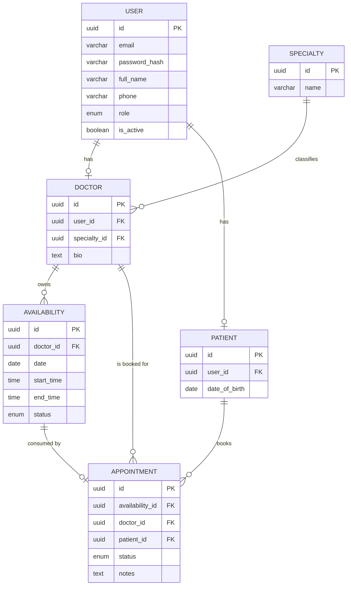

# Clinic Booking API — Database Design

## Database Overview

The schema is a straightforward relational model built around six tables. `users` holds shared account data (email, password, role) for everyone — patients, doctors, and admins alike. `doctors` and `patients` extend `users` with role-specific profile data via a one-to-one relationship. `specialties` is a small admin-managed lookup table. `availabilities` represents individual bookable time slots owned by a doctor, and `appointments` links a patient to a specific availability slot.

Each availability slot maps to at most one appointment, which is what makes double-booking structurally impossible rather than something enforced only in application code.

## Tables

### users

| Column | Type | Nullable | Default | PK | FK | Description |
|---|---|---|---|---|---|---|
| id | UUID | No | gen_random_uuid() | Yes | — | Primary key |
| email | VARCHAR(255) | No | — | No | — | Unique login email |
| password_hash | VARCHAR(255) | No | — | No | — | Bcrypt password hash |
| full_name | VARCHAR(150) | No | — | No | — | Display name |
| phone | VARCHAR(30) | Yes | NULL | No | — | Contact phone number |
| role | ENUM('PATIENT','DOCTOR','ADMIN') | No | — | No | — | Account role |
| is_active | BOOLEAN | No | true | No | — | Soft deactivation flag |
| created_at | TIMESTAMPTZ | No | now() | No | — | Record creation time |
| updated_at | TIMESTAMPTZ | No | now() | No | — | Record update time |

### specialties

| Column | Type | Nullable | Default | PK | FK | Description |
|---|---|---|---|---|---|---|
| id | UUID | No | gen_random_uuid() | Yes | — | Primary key |
| name | VARCHAR(100) | No | — | No | — | Unique specialty name (e.g. "Cardiology") |
| created_at | TIMESTAMPTZ | No | now() | No | — | Record creation time |

### doctors

| Column | Type | Nullable | Default | PK | FK | Description |
|---|---|---|---|---|---|---|
| id | UUID | No | gen_random_uuid() | Yes | — | Primary key |
| user_id | UUID | No | — | No | users.id | One-to-one link to the account |
| specialty_id | UUID | No | — | No | specialties.id | Doctor's specialty |
| bio | TEXT | Yes | NULL | No | — | Short professional bio |
| created_at | TIMESTAMPTZ | No | now() | No | — | Record creation time |
| updated_at | TIMESTAMPTZ | No | now() | No | — | Record update time |

### patients

| Column | Type | Nullable | Default | PK | FK | Description |
|---|---|---|---|---|---|---|
| id | UUID | No | gen_random_uuid() | Yes | — | Primary key |
| user_id | UUID | No | — | No | users.id | One-to-one link to the account |
| date_of_birth | DATE | Yes | NULL | No | — | Patient date of birth |
| created_at | TIMESTAMPTZ | No | now() | No | — | Record creation time |
| updated_at | TIMESTAMPTZ | No | now() | No | — | Record update time |

### availabilities

| Column | Type | Nullable | Default | PK | FK | Description |
|---|---|---|---|---|---|---|
| id | UUID | No | gen_random_uuid() | Yes | — | Primary key |
| doctor_id | UUID | No | — | No | doctors.id | Owning doctor |
| date | DATE | No | — | No | — | Date of the slot |
| start_time | TIME | No | — | No | — | Slot start time |
| end_time | TIME | No | — | No | — | Slot end time |
| status | ENUM('AVAILABLE','BOOKED') | No | 'AVAILABLE' | No | — | Whether the slot is still open |
| created_at | TIMESTAMPTZ | No | now() | No | — | Record creation time |
| updated_at | TIMESTAMPTZ | No | now() | No | — | Record update time |

### appointments

| Column | Type | Nullable | Default | PK | FK | Description |
|---|---|---|---|---|---|---|
| id | UUID | No | gen_random_uuid() | Yes | — | Primary key |
| availability_id | UUID | No | — | No | availabilities.id | The slot this appointment consumes (unique) |
| doctor_id | UUID | No | — | No | doctors.id | Denormalized for simpler querying |
| patient_id | UUID | No | — | No | patients.id | Booking patient |
| status | ENUM('PENDING','CONFIRMED','CANCELLED','COMPLETED') | No | 'PENDING' | No | — | Appointment lifecycle status |
| notes | TEXT | Yes | NULL | No | — | Optional patient-provided note |
| created_at | TIMESTAMPTZ | No | now() | No | — | Record creation time |
| updated_at | TIMESTAMPTZ | No | now() | No | — | Record update time |

## Relationships

```text
User (1) → (0..1) Doctor
User (1) → (0..1) Patient
Doctor (1) → (many) Availability
Doctor (1) → (many) Appointment      [denormalized]
Patient (1) → (many) Appointment
Availability (1) → (0..1) Appointment
Specialty (1) → (many) Doctor
```

- A `User` has at most one `Doctor` profile and at most one `Patient` profile (in practice, exactly one or the other, aside from admins who have neither).
- A `Doctor` owns many `Availability` slots.
- Each `Availability` slot is consumed by at most one `Appointment`.
- A `Patient` can have many `Appointment` records.
- Each `Doctor` belongs to exactly one `Specialty`.

## Constraints

- `users.email` — UNIQUE, NOT NULL
- `doctors.user_id` — UNIQUE, NOT NULL, FOREIGN KEY → `users.id`
- `patients.user_id` — UNIQUE, NOT NULL, FOREIGN KEY → `users.id`
- `doctors.specialty_id` — NOT NULL, FOREIGN KEY → `specialties.id`
- `specialties.name` — UNIQUE, NOT NULL
- `availabilities.doctor_id` — NOT NULL, FOREIGN KEY → `doctors.id`
- `appointments.availability_id` — UNIQUE, NOT NULL, FOREIGN KEY → `availabilities.id` (uniqueness is what prevents double booking at the database level)
- `appointments.doctor_id` — NOT NULL, FOREIGN KEY → `doctors.id`
- `appointments.patient_id` — NOT NULL, FOREIGN KEY → `patients.id`
- CHECK constraint on `availabilities`: `end_time > start_time`

## Indexes

- `users(email)` — supports login lookups (also backed by the UNIQUE constraint)
- `availabilities(doctor_id, date)` — supports the common "get a doctor's slots" query
- `appointments(patient_id)` — supports "get my appointments" for patients
- `appointments(doctor_id)` — supports "get my appointments" for doctors

No indexes are added beyond these; the tables are small and the above cover the actual query patterns in the PRD.

## ERD



## Design Decisions

- **User/Doctor/Patient modeling:** A single `users` table holds shared auth/account data for all roles, with `doctors` and `patients` as thin extension tables. This avoids duplicating email/password logic per role while keeping role-specific fields out of a bloated `users` table.
- **Appointment modeling:** Rather than storing a free-form date/time on `appointments`, each appointment is tied to a specific `availability` row. This makes the "one slot, one appointment" rule a database-level guarantee (via the UNIQUE constraint on `availability_id`) instead of something the application has to police on every write.
- **Availability:** Slots are created individually by the doctor (specific date + start/end time) rather than generated from a recurring pattern. This keeps slot management simple and avoids building a recurrence/scheduling engine, which is explicitly out of scope.
- **Appointment status:** A four-state enum (`PENDING → CONFIRMED → COMPLETED`, with `CANCELLED` reachable from either of the first two) is enough to demonstrate real lifecycle handling without inventing states the MVP has no use for.
- **Preventing double booking:** Enforced at two levels — the `UNIQUE` constraint on `appointments.availability_id`, and the `AVAILABLE`/`BOOKED` status on `availabilities`, which the booking transaction checks before insert.
